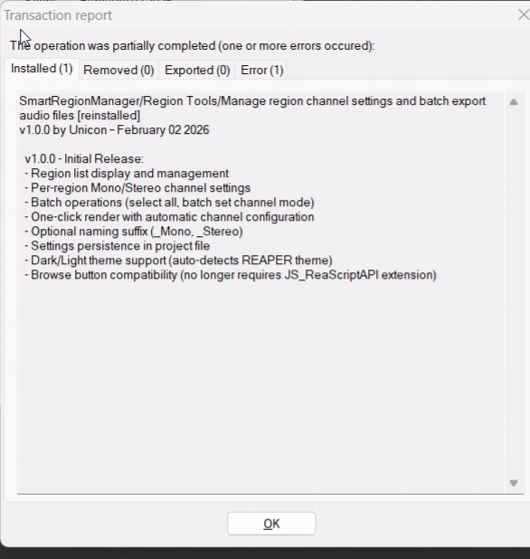

# Smart Region Manager 安装指南

## 前置要求

- **REAPER 6.0+**（推荐 7.0+）
- **ReaImGui 扩展**（安装脚本后会自动提示）

## 安装方式

选择最适合你的安装方式：

| 方式 | 推荐场景 | 自动更新 |
|------|----------|----------|
| ReaPack | 日常使用 | ✅ 支持 |
| 安装脚本 | Windows 快速安装 | ❌ 需手动 |
| 手动安装 | 任何平台 | ❌ 需手动 |

---

## 方式一：通过 ReaPack 安装（推荐）

> 详细步骤请参考 [REAPACK_INSTALL.md](REAPACK_INSTALL.md)

### 快速步骤

1. **添加仓库**
   - 菜单：`Extensions` → `ReaPack` → `Import repositories...`
   - 粘贴以下地址：
   ```
   https://raw.githubusercontent.com/AlgernonMXF/SmartRegionManager/main/index.xml
   ```
   - 点击 `OK`

2. **同步并安装**
   - `Extensions` → `ReaPack` → `Synchronize packages`
   - `Extensions` → `ReaPack` → `Browse packages`
   - 搜索 `Smart Region Manager` → 右键 `Install`

3. **重启 REAPER**

---

## 方式二：使用安装脚本（Windows）

### 首次安装

1. 下载项目文件（或 `git clone`）
2. 进入 `SmartRegionManager` 文件夹
3. 双击运行 `install.bat`
4. 按照提示完成安装

### 后续更新

1. 下载/拉取最新代码
2. 运行 `update.bat`

---

## 方式三：手动安装

1. **复制文件夹**
   - 将 `SmartRegionManager` 整个文件夹复制到 REAPER Scripts 目录：
     - **Windows**: `%APPDATA%\REAPER\Scripts\`
     - **macOS**: `~/Library/Application Support/REAPER/Scripts/`
     - **Linux**: `~/.config/REAPER/Scripts/`

2. **加载脚本**
   - 打开 REAPER
   - `Actions` → `Show action list`
   - `New action...` → `Load ReaScript...`
   - 选择 `SmartRegionManager.lua`

---

## 安装 ReaImGui（必需依赖）

如果运行脚本时提示 "Missing Dependency"：

1. `Extensions` → `ReaPack` → `Browse packages`
2. 搜索 `ReaImGui`
3. 右键 → `Install`
4. 重启 REAPER

---

## 验证安装

1. 打开 REAPER
2. `Actions` → `Show action list`
3. 搜索 `Smart Region Manager`
4. 运行脚本
5. 应该能看到 Smart Region Manager 窗口

### 安装成功示例

通过 ReaPack 安装成功后，会显示如下提示：



---

## 遇到问题？

- [TROUBLESHOOTING.md](TROUBLESHOOTING.md) - 常见问题解决
- [REAPACK_INSTALL.md](REAPACK_INSTALL.md) - ReaPack 详细指南
- [GitHub Issues](https://github.com/AlgernonMXF/SmartRegionManager/issues) - 提交问题
